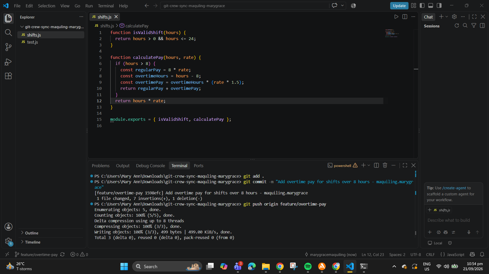
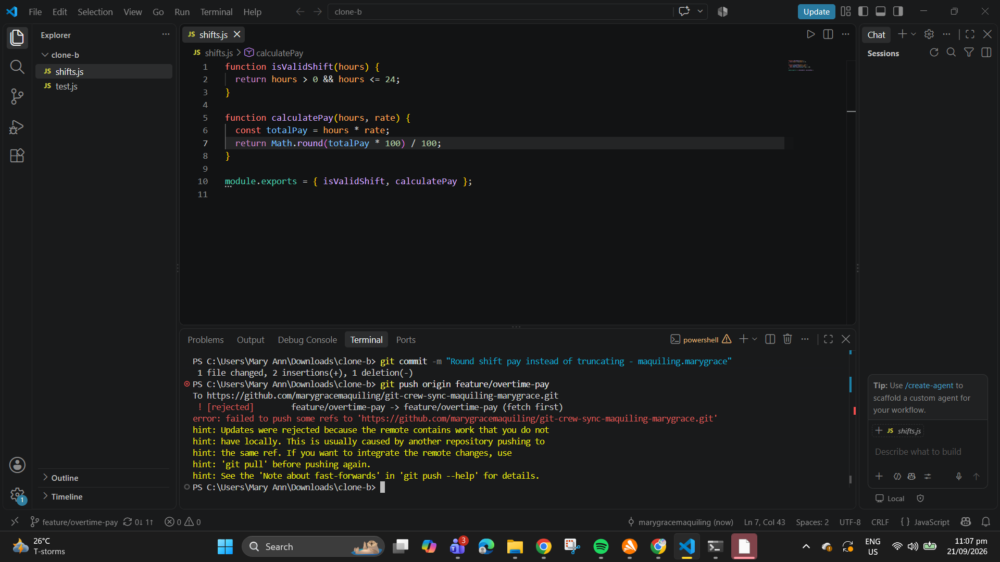
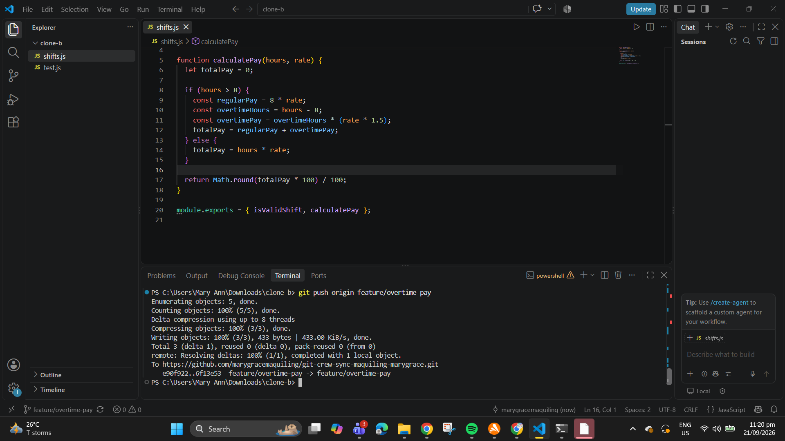
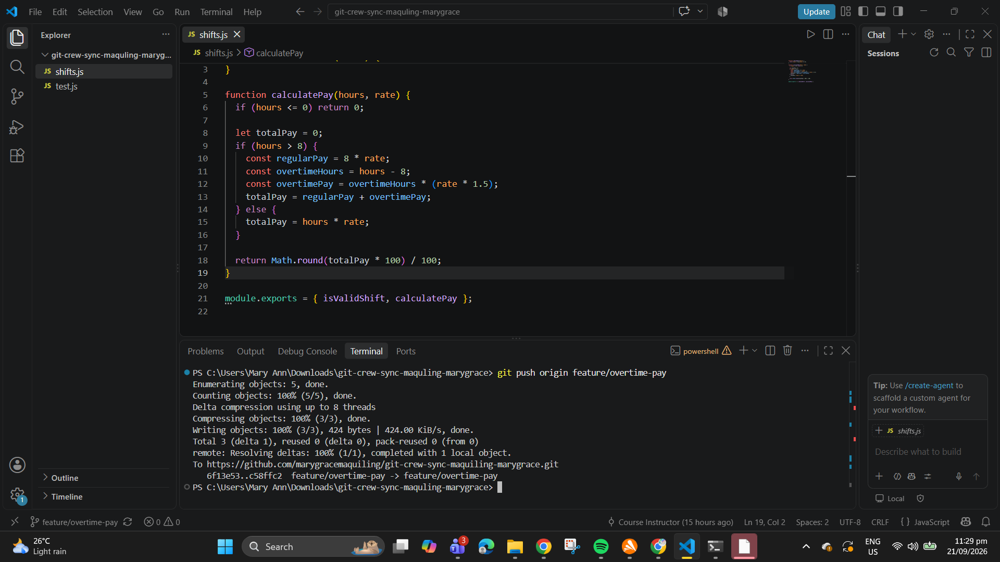
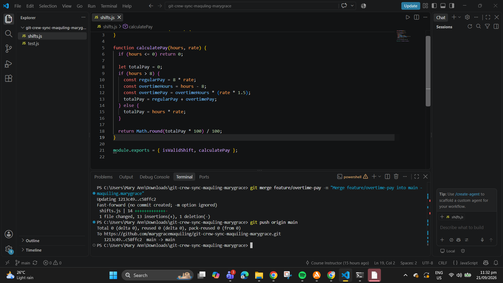
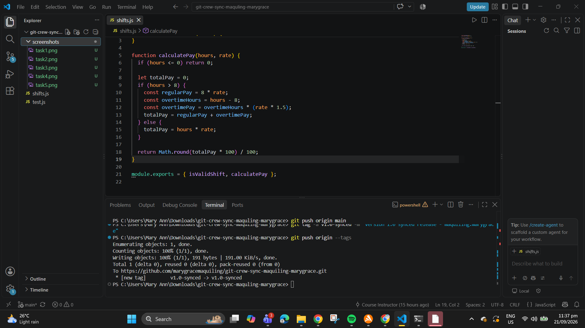

Crew Sync Lab - Workflow Documentation

Task 1: Push a Change from Clone A

Task 2: Diverge from Clone B (Rejected Push)

Task 3: Reconcile with a Merge

Task 4: Diverge Again - Reconcile with a Rebase

Task 5: Merge into Main

Task 6: Tag and Final Release

REFLECTION
1. What did the rejected push error message tell you, and why did it happen?
The error message stated `! [rejected] (non-fast-forward)` and explained that updates were rejected because the remote repository contained commits that did not exist in the local working copy. This happened because another clone/teammate pushed new commits to the shared remote branch after the local copy was last fetched.

2. What's the actual difference between how you resolved Task 3 (merge) vs Task 4 (rebase)?
In Task 3, `git merge` preserved both distinct histories by creating a dedicated **merge commit** that joined the remote and local branches together. In Task 4, `git rebase` rewrote the local history by temporarily setting aside local commits, applying the remote commits first, and then reapplying local commits on top to form a single linear history without a merge commit.

3. What one habit would have avoided both rejected pushes in this lab?
Running `git fetch` or `git pull` before making local code modifications or attempting to push changes to a shared branch.

4. Which approach - merge or rebase - would you default to on a shared team branch, and why?
I would default to `git merge` on a shared team branch. `git merge` is non-destructive and preserves historical accuracy without rewriting commit IDs that other developers may have already pulled. `git rebase` is better suited for cleaning up individual feature branches locally before integrating them into shared branches.